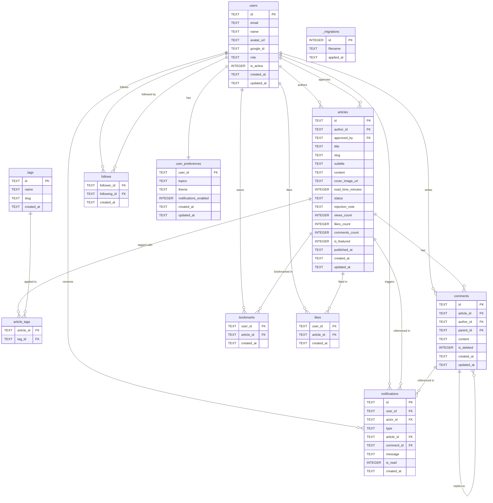

# zenos-db
Cloudflare D1 migrations &amp; seed scripts


## Entity Relationship Diagram


## Schema Notes

| Table | Purpose | Key Constraint |
|---|---|---|
| `users` | Auth + profiles | `role` CHECK: SUPERADMIN\|APPROVER\|AUTHOR\|READER |
| `articles` | Content store | `status` CHECK: DRAFT→SUBMITTED→APPROVED/REJECTED→PUBLISHED→ARCHIVED |
| `tags` | Taxonomy | `name` + `slug` UNIQUE |
| `article_tags` | Article↔Tag join | Composite PK `(article_id, tag_id)` |
| `comments` | Threaded comments | `parent_id` self-references for replies |
| `bookmarks` | User saved articles | Composite PK `(user_id, article_id)` |
| `likes` | Article likes | Composite PK `(user_id, article_id)` |
| `follows` | User follows | CHECK `follower_id != following_id` |
| `notifications` | Activity feed | `actor_id` nullable for system notifications |
| `user_preferences` | Topics + settings | 1:1 with users, `theme` CHECK: light\|dark\|system |
| `_migrations` | Migration tracker | Applied automatically by migrate.sh |

## Article Status Lifecycle
```
DRAFT → SUBMITTED → APPROVED → PUBLISHED → ARCHIVED
                 ↘ REJECTED → DRAFT (re-edit and resubmit)
```
