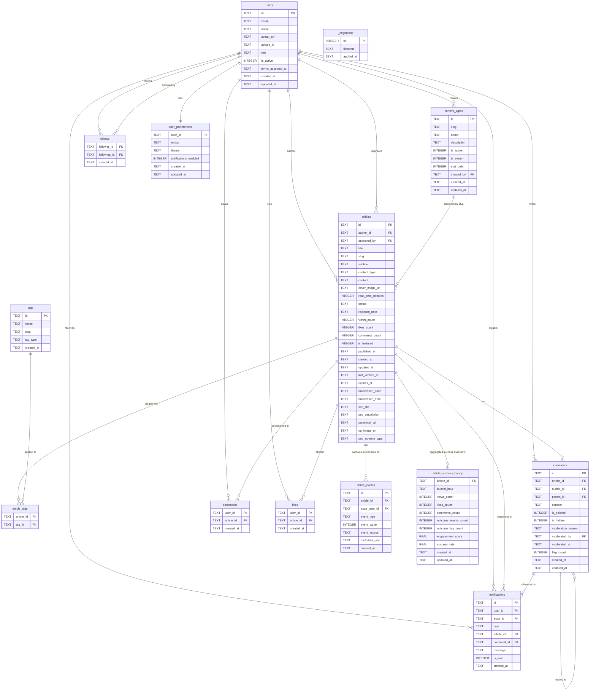

# zenos-db
Cloudflare D1 migrations &amp; seed scripts


## Entity Relationship Diagram


## Schema Notes

Default content bootstrap:
- Migration `0016_seed_system_default_articles.sql` inserts a `Zenos System` author plus published default stories for Tour, How-to, Software Writing, and Spotlight surfaces.
- These are real articles stored in D1 so landing pages, feeds, search, and article routes can render actual content in empty environments.

| Table | Purpose | Key Constraint |
|---|---|---|
| `users` | Auth + profiles | `role` CHECK: SUPERADMIN\|APPROVER\|AUTHOR\|READER |
| `articles` | Content store | `status` CHECK: DRAFT→SUBMITTED→APPROVED/REJECTED→PUBLISHED→ARCHIVED; includes moderation + SEO metadata |
| `content_types` | Dynamic article taxonomy | Runtime-managed by SUPERADMIN; `slug` UNIQUE and consumed by `articles.content_type` |
| `tags` | Taxonomy | `name` + `slug` UNIQUE; `tag_type` CHECK: topic\|outcome |
| `article_tags` | Article↔Tag join | Composite PK `(article_id, tag_id)` |
| `comments` | Threaded comments | `parent_id` self-references for replies; moderation flags support abuse handling |
| `bookmarks` | User saved articles | Composite PK `(user_id, article_id)` |
| `likes` | Article likes | Composite PK `(user_id, article_id)` |
| `follows` | User follows | CHECK `follower_id != following_id` |
| `notifications` | Activity feed | `actor_id` nullable for system notifications |
| `article_events` | SR-011 lightweight event stream | `event_type` CHECK: VIEW\|LIKE\|COMMENT\|OUTCOME |
| `article_success_hourly` | SR-011 hourly success aggregates | Composite PK `(article_id, bucket_hour)` |
| `user_preferences` | Topics + settings | 1:1 with users, `theme` CHECK: light\|dark\|system |
| `_migrations` | Migration tracker | Applied automatically by migrate.sh |

## SR-011 Analytics Path

- The backend records lightweight interaction events into `article_events` during read and engagement actions.
- A scheduled Cloudflare Worker Cron trigger runs hourly aggregation into `article_success_hourly`.
- Aggregates combine event counts and outcome-tag coverage into an `engagement_score` and capped `success_rate`.

## Article Status Lifecycle
```
DRAFT → SUBMITTED → APPROVED → PUBLISHED → ARCHIVED
                 ↘ REJECTED → DRAFT (re-edit and resubmit)
```
